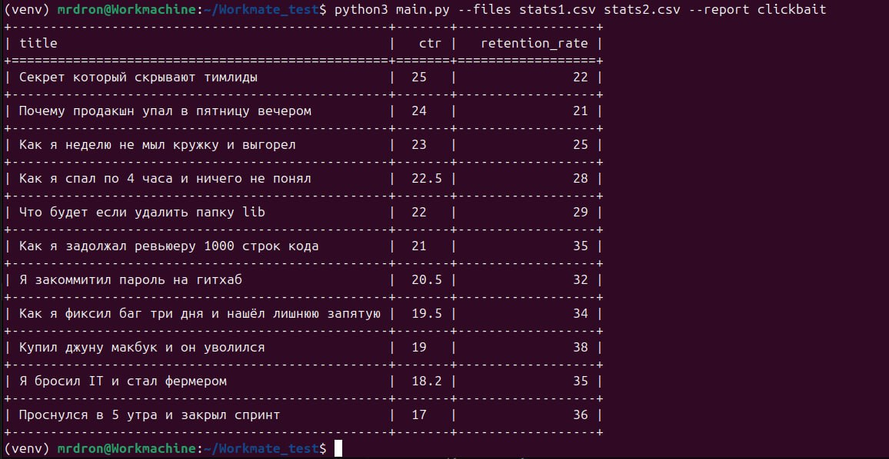
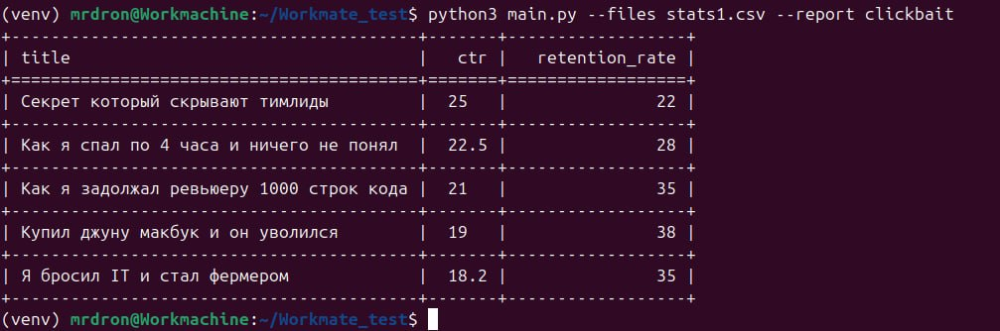
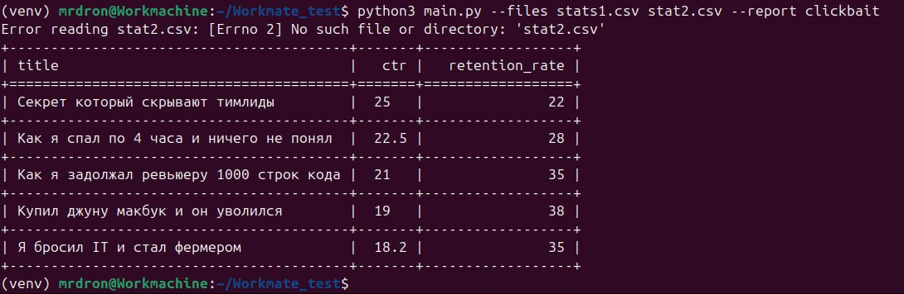

# Workmate test

CLI-приложение для формирования отчётов по CSV-файлам с метриками видео. Реализована расширяемая архитектура, позволяющая легко добавлять новые типы отчётов без изменения основной логики.

По условию задания не реализованы проверки валидности входных данных и оптимизация под большие объёмы файлов.

---

### Используется Python 3.12.3.

### Из внешних библиотек:
- tabulate 0.10.0 (для вывода таблиц в консоль)
- coverage 7.13.5 (для оценки покрытия тестами)
- ruff 0.15.11 (для проверки качества кода)

### Тестирование выполнено с помощью pytest 9.0.3.

---

## Примеры запуска

